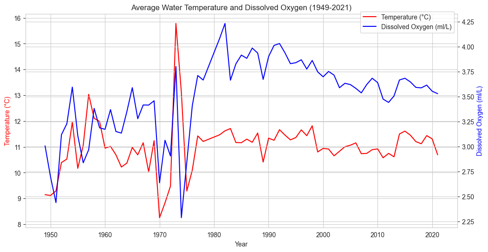
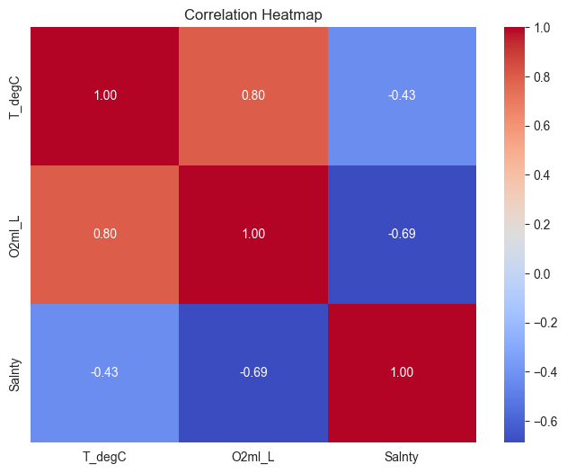

# CalCOFI Ocean Analysis: Temperature and Dissolved Oxygen Trends (1949–2021)

## Overview

Exploratory data analysis of the CalCOFI (California Cooperative Oceanic Fisheries Investigations) dataset examining how water temperature and dissolved oxygen levels have changed in California coastal waters over 70+ years. The analysis includes univariate and bivariate exploration, hypothesis testing, regression, classification, clustering, and time trend analysis.

## Dataset

The data comes directly from the [CalCOFI Bottle Database](https://calcofi.org/data/oceanographic-data/bottle-database/), a partnership between NOAA, Scripps Institution of Oceanography, and the California Department of Fish and Wildlife. After cleaning, the working dataset contains 720,707 water samples.

**The raw CSV files are not included in this repo due to size.** Download them from the CalCOFI site:
- `194903-202105_Bottle.csv` (bottle sample data)
- `194903-202105_Cast.csv` (cast metadata with dates and coordinates)

Place both files in the same directory as the notebook.

## Key Findings

- Water temperature and dissolved oxygen have a positive correlation of 0.80, which is counterintuitive since warm water holds less oxygen. Depth acts as a confounding variable driving both.
- Linear regression predicts oxygen from temperature with R² = 0.64; polynomial regression improves to R² = 0.70.
- Logistic Regression classifies high vs low oxygen at 94.8% accuracy; Random Forest at 95.0%.
- K-means clustering identified three groups matching known oceanographic water mass types (surface, mid-depth, deep) with a silhouette score of 0.44.
- Both temperature and oxygen show a declining trend from the 1980s through 2021.

## Visualizations

*Annual average temperature and dissolved oxygen, 1949–2021*

*Correlation heatmap of temperature, dissolved oxygen, and salinity*

## Files

- `calcofi_analysis.ipynb` — Full analysis notebook with code, outputs, and documentation
- `project_narrative.pdf` — Project narrative with visualizations

## Tools

- Python 3.8 (Miniconda)
- pandas, numpy, matplotlib, seaborn, scipy, scikit-learn

## Author

Brittany Blessie — MS Data Science, Bellevue University
